# 00. Overview

## Purpose

A party who wants a Kleros v2 dispute decided currently creates it through the Kleros Court web
client. This specification describes a headless command-line tool that makes the same two writes
directly against Arbitrum One — creating a dispute and submitting evidence — so that the party can
file from a server, a script, or an autonomous agent, without a browser.

**The primary consumer is an LLM agent, not a human.** A human at a terminal is a debug surface
only. Every consequence of that runs through this specification: JSON on stdout, a stable `code` on
every failure, prose that restates the machine state, and no interactive confirmation anywhere.

## Non-goals

The following are **out of scope** and MUST NOT be implemented from this specification.

1. **Case construction.** The claim, the evidence text, the court, the juror count and the ruling
   options are inputs. This tool decides none of them and drafts none of them. See
   [`CONTEXT.md`](../../CONTEXT.md) for the filing / case-construction boundary and
   [ADR-0001](../adr/0001-standalone-repo-shaped-for-upstreaming.md) for why it falls there.
2. **Discovery.** Finding which disputes an address is party to, reading a dispute's state for its
   own sake, resolving dispute templates, listing evidence. `@kleros/agentkit` does that. The only
   reads here are those that can change the decision to sign.
3. **Reading counterparty content.** This tool never fetches, parses or interprets evidence, a
   policy, or any URI found in on-chain data. [ADR-0007](../adr/0007-evidence-is-opaque-operator-supplied-bytes.md)
4. **IPFS pinning.** Every URI is an input the caller supplies.
   [ADR-0009](../adr/0009-the-cli-references-ipfs-and-never-pins.md)
5. **ERC-20 arbitration fees.** ETH only, until [Appendix A §1](./appendix-a-unresolved.md) is
   settled. There is no `--fee-token` flag. [ADR-0008](../adr/0008-arbitration-fees-are-paid-in-eth-only.md)
6. **Daemon or watcher mode.** Every command is one-shot and exits.
7. **Voting, staking, drawing, appeal funding, ruling execution.** The disputant is not the juror.
8. **Networks other than Arbitrum One.**

## Actors

| Actor | Role |
| --- | --- |
| The party creating the dispute | Owns the signing key and the ETH. Decides the claim, the court and the ruling options |
| CLI | Validates the inputs, quotes the cost, builds the payloads, simulates, signs and broadcasts |
| `DisputeResolver` | The generic permissionless arbitrable. **The only dispute-creation entry point available to an EOA** |
| `KlerosCore` | The arbitrator. Quotes the arbitration cost, holds the dispute, draws jurors, delivers the ruling. Read-only from the CLI's perspective |
| `EvidenceModule` | Emits evidence. No access control, no payment, no period gate |
| `DisputeTemplateRegistry` | Allocates the template ID. Written to indirectly, by `DisputeResolver` |

The tool's account calls `DisputeResolver` and `EvidenceModule` directly. It never calls
`KlerosCore` except to read.

**The party creating the dispute MUST NOT be a juror in the same dispute.** This is not cheaply
detectable on chain and the tool does not check it. It is an operator responsibility, and the tool
MUST NOT present any check it does make as a guarantee of this one.

## The two write flows

```mermaid
flowchart TD
    subgraph create["create-dispute"]
        A["court, jurors, kit, template body, ruling options"] --> B["build extraData (96 bytes)"]
        B --> C{"pre-flight, all local or read-only"}
        C -- "refuse" --> X["named error code, nothing sent"]
        C -- "pass" --> D["arbitrationCost(extraData) — byte-identical blob"]
        D --> E["simulateContract on DisputeResolver, value = cost"]
        E --> F{"--broadcast?"}
        F -- "no" --> G["status: simulated. Nothing was sent"]
        F -- "yes" --> H["writeContract, value = cost exactly"]
        H --> I["parse KlerosCore.DisputeCreation for the core dispute ID"]
    end

    subgraph evidence["submit-evidence"]
        J["core dispute ID, name, description, optional fileURI"] --> K["build inline evidence JSON"]
        K --> L{"does the core dispute exist?"}
        L -- "no" --> Y["refuse: DISPUTE_NOT_FOUND"]
        L -- "yes" --> M["warn if the period is past evidence — never refuse"]
        M --> N["simulate, then broadcast on --broadcast"]
    end
```

The asymmetry between the two is the point. Creating a dispute **spends money and cannot be
undone**; submitting evidence costs gas only and can be repeated. So the pre-flight on the left is
elaborate and the one on the right is nearly empty — and the one refusal on the right exists
because evidence filed against a dispute that does not exist is unreachable, not because the
contract objects. [ADR-0011](../adr/0011-evidence-period-pressure-warns-and-never-refuses.md)

## Why pre-flight carries the whole safety burden

In the juror CLI, `simulateContract` is a second line of defence: a wrong choice or a wrong period
reverts, and simulation surfaces the revert before a transaction is paid for.

**That second line does not exist here.** `KlerosCore` decodes `_arbitratorExtraData` with bounds
checks that substitute defaults rather than revert. A wrong court ID, an out-of-range court ID, a
zero juror count, a malformed blob and empty bytes all simulate cleanly, all quote the same cost,
and all create a real, paid dispute in the General Court with three jurors. **[live]** — see
[01 §4.3](./01-onchain-reference.md) and [02 §2](./02-payload-construction.md).

So local validation is not belt-and-braces. It is the only thing standing between a typo and an
irreversible paid mistake, and this specification treats it that way.

## Glossary

The vocabulary is defined in [`CONTEXT.md`](../../CONTEXT.md) and is not repeated here. Three
distinctions are load-bearing enough to restate, because getting them wrong is silent:

| Term | Meaning in this document |
| --- | --- |
| **Core dispute ID** | The index in `KlerosCore.disputes[]`, reported by `DisputeCreation`. What `--dispute` takes |
| **Local dispute ID** | `DisputeResolver`'s own index, mapped back by `arbitratorDisputeIDToLocalID`. Not what any command takes |
| **External dispute ID** | The third field of `DisputeRequest`. What the Kleros Court web client uses to look evidence up. **[fork]** It is the local dispute ID |

On Arbitrum One today all three are numerically equal for every dispute in existence, because
`DisputeResolver` created every one of them. **[live]** That coincidence is why the distinction is
easy to get wrong and impossible to catch by testing against production; a fork seeded with a
second arbitrable is where it separates. **[fork]** `createDisputeForTemplate` returns the **core**
dispute ID — this table said the local one until that fork ran. See
[01 §7](./01-onchain-reference.md).

## Normative summary

- The CLI **MUST** assert `eth_chainId == 42161` at runtime, and **MUST** do so **before** any
  deployment registry lookup.
- The CLI **MUST** validate the court ID, the juror count and the dispute kit ID locally, and
  **MUST** refuse with a named code rather than let `KlerosCore`'s decoder substitute a default.
- The CLI **MUST** call `isSupported(courtID, disputeKitID)` on every invocation and **MUST NOT**
  cache the result.
- The CLI **MUST** quote `arbitrationCost` with the byte-identical `extraData` it is about to send,
  and **MUST** send exactly that value.
- The CLI **MUST** echo the **effective** court, juror count and dispute kit in its output, and
  **MUST** treat any difference from the requested ones as an error rather than a warning.
- The CLI **MUST** simulate every state-changing call, and **MUST NOT** broadcast without an
  explicit `--broadcast`. There is no human confirmation gate.
  [ADR-0004](../adr/0004-broadcast-is-opt-in-no-human-gate.md)
- The CLI **MUST** report a broadcast whose receipt never arrived as a success of unknown outcome,
  and **MUST** state in prose that re-sending would pay the arbitration cost a second time.
- The CLI **MUST NOT** print the private key, and **MUST NOT** accept one from the environment or
  the command line.
- The CLI **MUST NOT** parse, interpret or dereference operator-supplied evidence, and **MUST NOT**
  let its content influence which call is made or with what arguments.
